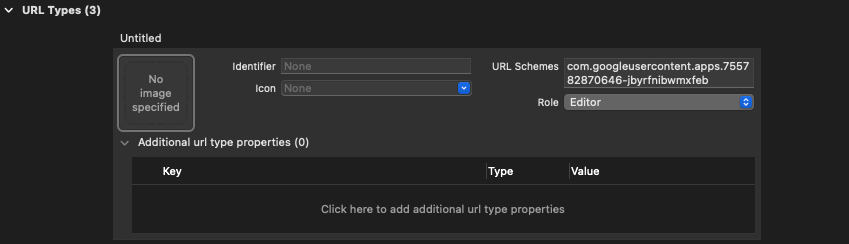

# OpenGoogleSignInSDK

OpenGoogleSignInSDK is an open-source library which takes care of Google Sign-In flow using OAuth 2.0 and can be used as an alternative to GoogleSignIn SDK.

## Installation

### Swift Package Manager

SDK can be installed using [SPM](https://github.com/apple/swift-package-manager). Just add following line into your `Package.swift`: 

```swift
.package(url: "https://github.com/AckeeCZ/OpenGoogleSignInSDK.git", .upToNextMajor(from: "1.0.0")),
```

or use the Xcode `File -> Swift Packages -> Add Package Dependency` and paste the URL of GitHub repository.

## Integration guide

### Add a URL scheme to your project

Google Sign-In flow requires a URL scheme to be added to your project:

1. Open your project configuration, select your app from the **Targets** section, then select the **Info** tab and expand the **URL Types** section.
2. Click the **+** button, and add your reversed client ID as a URL scheme. The reversed client ID is your client ID with the order of the dot-delimited fields reversed, like on the picture below:



### Set OAuth 2.0 client ID

First, you need to visit [Google API Console](https://console.developers.google.com/apis/credentials?project=_) to obtain OAuth 2.0 client ID of your project. After obtaining the client ID, you need to configure the `clientID` property of `OpenGoogleSignIn` shared instance in your app delegate:

```swift
func application(_ application: UIApplication,
                 didFinishLaunchingWithOptions launchOptions: [UIApplication.LaunchOptionsKey: Any]?) -> Bool {
  OpenGoogleSignIn.shared.clientID = "YOUR_CLIENT_ID"

  return true
}
```

### Handle Sign-In process

To handle Sign-In process, you need to set `OpenGoogleSignInDelegate` and implement the protocol:

```swift
OpenGoogleSignIn.shared.delegate = self

...
...
...

func sign(didSignInFor user: GoogleUser?, withError error: GoogleSignInError?) {
  // Signed in user or error received here.
  // Perform any required operations.
}
```

## Author

[Ackee](https://ackee.cz) team

## License

OpenGoogleSignInSDK is available under the MIT license. See the LICENSE file for more info.